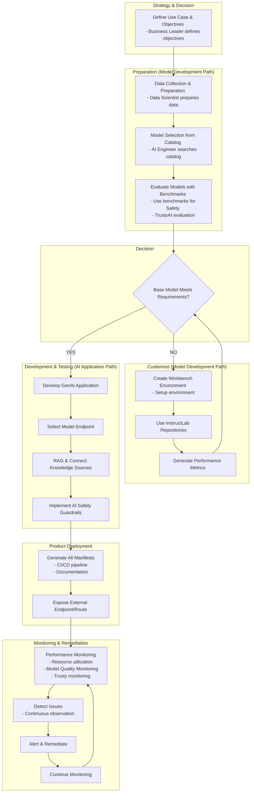

# Behavior & Performance Design Document

## Overview
This document outlines the behavior and performance considerations for AI model development and deployment workflows.

## Purpose
- Document behavior patterns in AI workflows
- Define performance requirements and monitoring
- Track implementation details for model lifecycle

## Workflow Diagram

## Behavior Patterns

### Model Development Path
- Data preparation and model selection
- Customization through workbench environments
- Performance evaluation and iteration

### AI Application Path
- Application development with safety guardrails
- Knowledge source integration
- Endpoint configuration

### Monitoring & Remediation
- Continuous performance monitoring
- Issue detection and alerting
- Automated remediation processes

## Performance Requirements

### Key Performance Indicators
- Model accuracy and reliability
- Resource utilization efficiency
- Response time and throughput
- Safety and compliance metrics

### Monitoring Strategy
- Real-time performance tracking
- Quality assurance through TrustyAI
- Continuous observation and alerting

## Implementation Notes
- CI/CD pipeline integration
- Documentation generation
- External endpoint exposure
- Continuous monitoring setup

## References
- TrustyAI evaluation framework
- InstructLab repositories
- Performance monitoring standards
